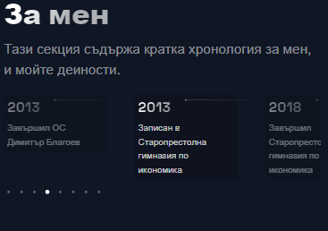
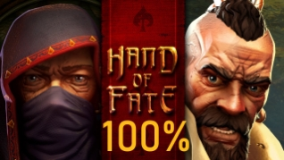
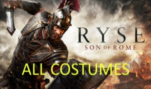
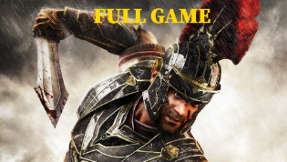
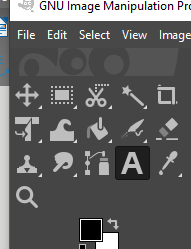
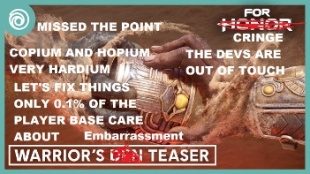
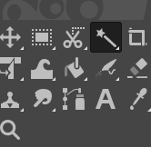
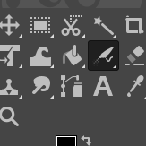
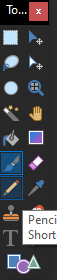

![ref1]![ref1]

Великотърновски университет "Св. св.Кирил и Методий"

**Kурсова работа**

по дисциплина „Мултимедийни технологии“

**Изготвено от Даниел Радев**

Съдържание:

- 1. Въве дение в проекта:
- 2. Средства за изработване на уебсайта
  - 2.1. HTML, CSS, JavaScript
  - 2.2. React и Next.js
  - 2.3. Styled-components
- 3. Обяснение на уебсайта
  - 3.1. Header и Footer
  - 3.2. Добре Дошли
  - 3.3. Проекти
  - 3.4. Софтуер
  - 3.5. За мен
- 4. Медийни проекти
  - 4.1. Изображения
  - 4.2. Видеа

1\. Въведение в проекта:

Моят проект представлява уебсайт „портфолио за мултимедии“. Сайта показва всички видеа които съм направил за моят YouTube канал, кратко пояснение за тяхното създаване, софтуера и техниките използвани за тяхното създаване както и кратка автобиография за мен.

2\. Средства за изработване на уебсайта 

Уебсайта е написан на чист код използвайки VSCode за писането на проекта. Използвани са HTML, CSS, JavaScript, React и Next.js както и още няколко по малки библиотеки.

2\.1.  HTML, CSS, JavaScript

HTML е основен за всеки сайт и чрез него се създава структурата на сайта,  CSS и JavaScript кода обаче са малко по различни понеже използваме React и Next.js.

2\.2.  React и Next.js

React е JavaScript библиотека предназначена за създаване на интерфейси и компоненти за тях. Детства чрез създаването на готови HTML модели които се извикват чрез JavaScript и се показва на сайта, но има особени недостатъци за които са нужни и други библиотеки.

Taм влиза Next.js, специална рамка предназначена специфично за React която позволява сайта и неговите елементи да бъдат заредени преди тяхното представяне в браузъра.

2\.3. Styled-components

Styled-components е рамка която позволява стилизирането на React компоненти по начин неподобаващ на създаване на изцяло нови HTML тагове, и прави писането на React код и процеса на неговото стилизиране много по лесен.

3\. Обяснение на уебсайта

В този раздел ще минем на кратко през всяка секция на сайта обяснявайки структурата и конструкцията му.

3\.1. Header и Footer

Тези елементи съдържат повечето обичайни елементи като препратки към секциите на сайта, както и други важни препратки към YouTube канала на който са качени медийните проекти. Най важните способности са: факта че при натискане на пощите и номера освен хубавите hover ефекти, пренасочва към вашата Gmail поща позволявайки бързо и лесно изпращане на поща.

Тука има част от стилизиране което съм използвал за елементите

3.2. Добре Дошли

Welcome секцията е проста секция обясняваща причината за съществуването на сайта, бутон който препраща към моят канал, тази секция е много елементарна от страна на кода.

Единственото забележително нещо за тази секция е анимацията зад текста чиито код е много голям и не мога да покажа цялостно като снимка.

3.3. Проекти

Тази секция е най-важната за портфолиото понеже съдържа кратко обяснение и линкове към медийните ми проекти, проектите са качени в моят YouTube канал. Тука се използва много полезна функция на React (Map), която позволява лесното показване на данни от масиви. Детайлите за самите проекти ще имат своя собствена секция по-нататък.

3\.4. Софтуер

Тази секция служи за информиране 

на читателя кои средства съм използвал за създаването на проектите, кратко обяснение за тях и кои техни инструменти съм използвал. Ще вляза в повече детайли за тях при обясняването на самите проекти.

Стилизирана е като списък където всяка програма е собствен предмет от списъка, целия списък е организиран като греда.

3\.5. За мен

Тази секция служи като кратка автобиография и също времева линия на моите дейности.

Времевата линия и целия сайт в този случаи са респонзивни, тоест работят и при мобилни устроиства.

4\. Медийни проекти

Всичките изображение и видеа са създадени от мене изцяло или модифицирани елементи взети от интернет, повечето видеа са изцяло създадени чрез „DaVinci Resolve”, докато повечето изображения са взети от Интернет и редактирани от мене главно в софтуера „Gimp”.

4\.1. Изображения

Редактираните изображения могат да бъдат разделени на няколко типа, първо да разгледаме тези в които просто съм добавил текст и нищо друго.

За всички тези снимки редактирането се състои от добавяне на текст и приближаване към определена част от изображението, текста се добавя в отделен слой на изображението за да може лесно да се мести и променя без да разрушава изображението.

Другият тип са изображения с по сложни промени които не са само добавен текст а и други техники за по сложни изображения.

За някои от тези изображения е бил добавен текст като на предишните, но освен това са били използвани, молив или четка за ръчно рисуване върху изображението, вмъкване на геометрични елементи, сливане на няколко изображения, избиране на елементи от изображения и преместването им в други изображения и трансформиране на изображения.

4\.2. Видеа

Видеата също могат да бъдат разделени в няколко типа, но пак ще ги разделим на два типа, за всички видеа съм използвал „OBS” за записването на клиповете и аудиото. „DaVinci Resolve“ за редактирането използващи основни функции на софтуера.

Първият тип са тези с минимално редактиране, тези са видеа представляващи записи които направих докато играех игри и са типично много дълги понеже са записи от началото до края на играта и понякога след края ако има още неща за правене. Те са с минимално редактиране,   състоят се от комбинирането на всички клипове в едно голямо видео и променяне на силата на звука да е по-нисък или голям, зависещо от моя преценка.

Този процес на вкарване на клиповете и вкарването им в времевата линия е еднакъв за всички видеа.

Другия тип видеа са с повече редактиране и малко по комплексни от предишните. Едно от тях е прост от страна на използваните техники понеже е само вмъкване на звукови ефекти и изображения но времевата линия е доста сложна, подреждането, оформянето и позиционирането на тези елементи е сложната част вместо техниката.

Другото видео, докато изглежда по елементарно, е сложно по друг по-необичаен начин, всички клипове на начин 1вия ред са били трансформирани като размер, позиция и други такива атрибути да пасват с тези от втория.

**Благодаря за вниманието**

[ref1]: Aspose.Words.f591f248-4f38-4522-8aa2-e9f0a47db17b.001.png
